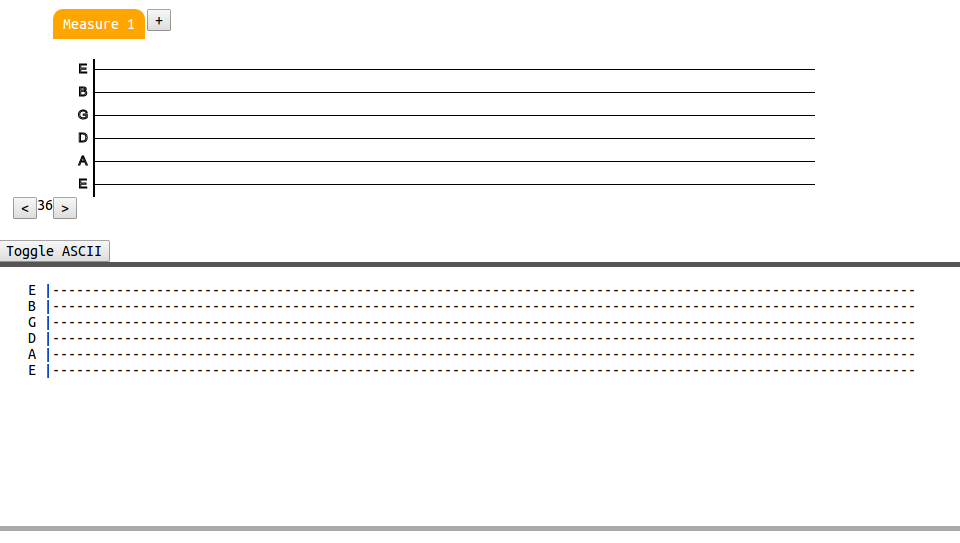

scratch-tabs
=======
Scratch-tabs is a **guitar tablature writer** focused on providing a quick and easy interface. Jot down your guitar riff wherever inspiration strikes.

This is a work in progress based on the [ram-tabs](https://github.com/The13thDoc/ram-tabs) project.

#### Status: **[Live Prototype](https://the13thdoc.github.io/scratch-tabs/)**  
#### 0.1.1
(As of September 1st, 2015)  

#### Status: **In Development and Testing**  
#### 0.1.2

[(Semantic Versioning Guide)](http://semver.org/)

#### Ongoing design docs:
[Scratch tabs design](https://docs.google.com/drawings/d/1aF2JeQ9Zi2AEM_f2ANQ4f1Uy9LuKfW33Ym_UDrNsmNU/edit?usp=sharing)
